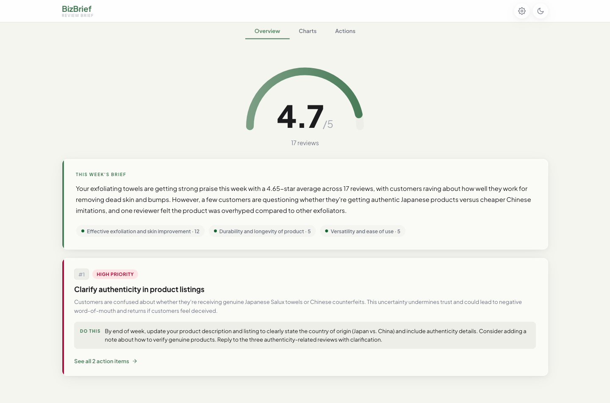
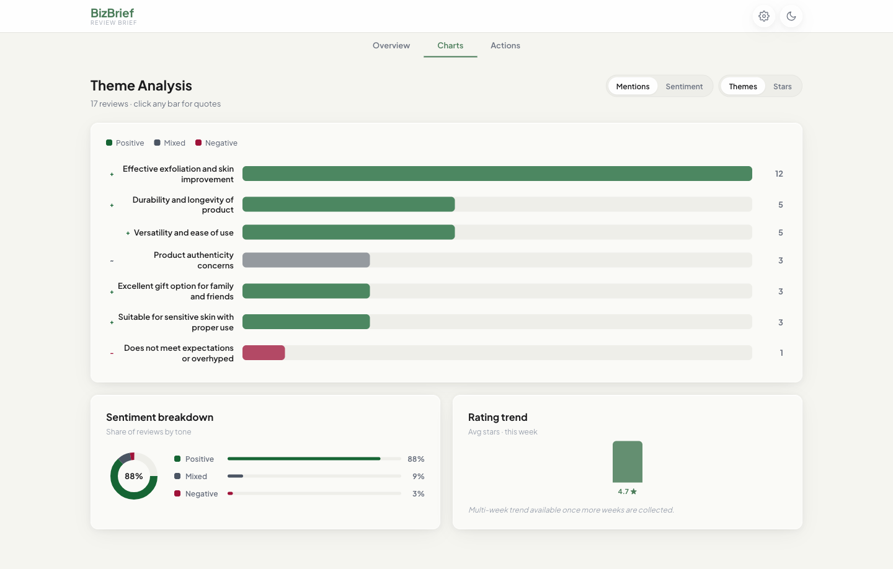
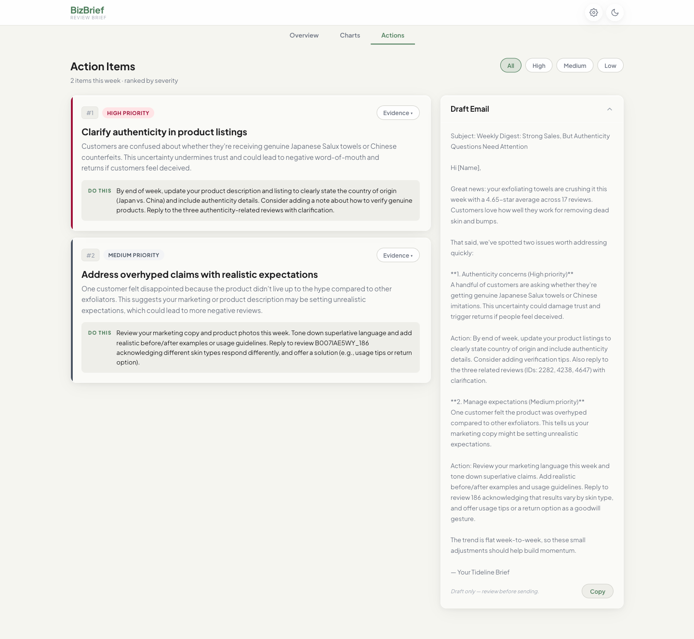

# BizBrief

> Turns a flood of customer reviews into a clear weekly action brief for small-business owners — at production-grade reliability and demo-grade cost.



BizBrief ingests Amazon product reviews, classifies recurring themes with Claude, and produces a **prioritized weekly action brief**: top issues ranked by impact, each with a concrete recommended action and the review evidence behind it. A business owner can read the full picture in 15 seconds. Briefs run on a recurring schedule through a reliability layer that handles retries, cost caps, idempotent reruns, and structured logs.

| Charts — theme bars + sentiment donut | Actions — ranked items + draft email |
|---|---|
|  |  |

---

## Cost engineering

BizBrief routes each review batch to the cheapest model that can handle it — Haiku for simple batches, Sonnet for moderate, Opus for complex — rather than sending everything to one model. Prompt caching pins the ~2,300-token system prompt on Anthropic's servers so the static instructions are only billed at full rate once per cache window; subsequent calls read the prefix at 1/10th the input rate. Caching is verified live on Sonnet and Opus (a repeat call reports `cache_read_input_tokens` covering the full system prompt). Haiku has a higher minimum cacheable prefix and is left uncached — its input rate is already 4–18× cheaper, so the marginal cache savings don't justify inflating the prompt.

### Live eval results — 17 reviews, 1 batch (B007IAE5WY / 2017-W38)

| Model | Cost/run | Label F1 | Evidence Overlap | Sentiment Acc |
|---|---|---|---|---|
| **Haiku** | **$0.0045** | **0.60** | 0.82 | 1.00 |
| Sonnet | $0.0169 | 0.18 | 1.00 | 1.00 |
| Opus | $0.0900 | 0.50 | 0.93 | 1.00 |

Haiku returns the highest F1 on this batch at 36× lower cost than Opus. Sonnet's lower F1 reflects that it reframes theme labels differently from the golden set — the underlying themes are correct, but the label wording diverges more. Evidence overlap and sentiment accuracy are strong across all three.

### Routing math

| Scenario | Cost/1k reviews | vs. naive Sonnet-everywhere |
|---|---|---|
| Naive (Sonnet only) | ~$0.99 | baseline |
| Routed (Haiku 70% / Sonnet 20% / Opus 10%) | ~$0.34 | **–66%** |
| Routed + prompt cache hits | ~$0.28 | **–72%** |

At 500 reviews/week across 10 businesses, routing + caching saves roughly $35/month vs. a single-model approach. The complexity scorer (review length 40%, star variance 35%, vocabulary richness 25%) routes each batch in < 1 ms with no additional API calls.

### Cost dashboard

The `/api/metrics` endpoint aggregates structured logs by model and stage in real time. The **Cost** tab in the UI shows total spend, routing mix (donut), cost by model (bar), avg latency, idempotency cache skips, and prompt-cache savings — so cost is always visible, not buried in a log file.

---

## Security

BizBrief was red-teamed before shipping. **14 findings filed; 12 fixed; 2 acknowledged LOW (no fix required).**

| Control | Implementation |
|---|---|
| Rate limiting | Per-real-IP sliding window (60 reads / 10 writes per minute). IP read from `request.client.host` only — X-Forwarded-For is stripped at the ASGI layer and blocked at the uvicorn layer (`forwarded_allow_ips=[]`). |
| Auth | `X-API-Key` required on all mutating routes. 5 wrong attempts → 300 s ban per IP. Constant-time comparison. |
| Path traversal | Business ID / week validated by regex; `os.path.realpath` containment check prevents `../../` escapes. |
| Body cap | 10 KB max on all routes (returns 413). |
| Error handling | Generic exception handler — no stack traces, input echoes, or internal paths in responses. |
| Log injection | `model` / `stage` keys in `/api/metrics` response are allowlisted via `Config.allowed_models` / `Config.allowed_stages`. |
| Read amplification | `/api/metrics` capped at `metrics_max_days=30` files and `metrics_max_lines=50,000` lines; response includes `"truncated"` flag. |

**Server must be started with `api/run.py`** (programmatic uvicorn with `forwarded_allow_ips=[]`) — not the `uvicorn` CLI, which reads `FORWARDED_ALLOW_IPS` from the environment before app modules load.

---

## Serverless deployment (AWS)

An event-driven serverless version of the pipeline lives in [infra/](infra/) as AWS SAM. Dropping `uploads/<business>/<week>.jsonl` into an S3 bucket fires an **ingest → analyze → brief** Lambda chain that persists to DynamoDB and renders the brief back to S3, with cost / latency / throughput published to a **live CloudWatch dashboard**.

```
s3://raw/uploads/<biz>/<week>.jsonl ──S3 event──▶ IngestLambda ──▶ AnalyzeLambda ──▶ BriefLambda
                                                       │               │                 │
                                                       ▼               ▼                 ▼
                                                   DynamoDB (single-table: REVIEW#/THEMES#/BRIEF#)
                                                       │                                 │
   all 3 ──put_metric_data──▶ CloudWatch dashboard    └────── brief JSON ──▶ s3://briefs/
   failed async invokes ─────▶ SQS dead-letter queue
```

The Lambdas **import the existing `pipeline/` and `reliability/` modules** — the model router, prompt caching, retry/backoff, cost ceiling and idempotency cache all carry over unchanged. The only new code is `infra/lambdas/storage.py` (S3 + DynamoDB adapter) and `metrics.py` (CloudWatch emitter).

> **Status: deployable, not deployed.** This is complete, importable handler code + IaC, not pseudo-code — its AWS-independent surface is covered by 19 tests in [tests/test_serverless.py](tests/test_serverless.py). It is intentionally not `sam deploy`'d, since running it incurs AWS + Anthropic charges. See [infra/README.md](infra/README.md) for the architecture, DynamoDB design, `sam local invoke` instructions, and the deploy walkthrough.

---

## Quick start

```bash
# 1. Install
uv sync
cd web && npm install && cd ..

# 2. Add API key
cp .env.example .env
# edit .env → ANTHROPIC_API_KEY=sk-ant-...

# 3. Ingest data + prepare demo businesses
uv run python -m pipeline.ingest
uv run python -m pipeline.prepare_demo --business B007IAE5WY --target-week 2022-W40
uv run python -m pipeline.prepare_demo --business B012Q9NGE4 --target-week 2021-W30

# 4. Run the pipeline
uv run python -m pipeline.brief --business B007IAE5WY --week 2022-W40 --skip-ingest
uv run python -m pipeline.brief --business B012Q9NGE4 --week 2021-W30 --skip-ingest

# 5. Start the API + UI (two terminals)
uv run python -m api.run          # → http://localhost:8000
cd web && npm run dev              # → http://localhost:5173

# 6. Smoke tests
make smoke
```

---

## Demo businesses

| ASIN | Product | Reviews | Week |
|---|---|---|---|
| `B007IAE5WY` | Salux Nylon Exfoliating Cloth | 17 | 2022-W40 |
| `B012Q9NGE4` | Moroccan Argan Oil Shampoo | 10 | 2021-W30 |

---

## Project layout

```
pipeline/
  ingest.py        download + normalize reviews → data/processed/reviews.jsonl
  analyze.py       classify themes via Claude → ThemeReport JSON
  brief.py         prioritize + write action brief → Brief JSON
  router.py        complexity scorer → picks Haiku / Sonnet / Opus per batch
  config.py        Config dataclass (all tunables, including routing thresholds + security limits)
  prepare_demo.py  aggregate sparse reviews into a single demo week

reliability/
  call_model.py    ALL model calls go through here (backoff, cost cap, idempotency, logging,
                   per-call model override, prompt-cache token tracking)
  logger.py        StructuredLogger → data/logs/<date>.jsonl + runs.jsonl + dead-letter/

scheduler/
  run.py           run_once() + APScheduler daily job + circuit breaker

api/
  main.py          FastAPI: /api/businesses · /api/brief · /api/schedule · /api/runs · /api/metrics · /api/eval
  security.py      StripProxyHeaders · RateLimitMiddleware · MaxBodySize · require_api_key ·
                   AuthFailureLockout · CostGuard · safe_path_join · validate_business_id
  run.py           programmatic uvicorn entry point (forwarded_allow_ips=[] — must use this)

web/
  src/
    App.tsx        root — loads API data, falls back to fixtures
    api.ts         typed fetch client
    types.ts       contract types (mirrors CONTRACTS.md)
    fixtures.ts    demo fixtures for offline development
    components/    Header · BriefPanel · ThemeChart · TrendIndicator · EmailDraft ·
                   SchedulePanel · RunStatus · EmptyState · CostTab · EvalTab

eval/
  seam.py          compare() · score_classification() · score_brief_quality()
                   Fuzzy label matching (Jaccard ≥ 0.25, stop-words excluded)
  runner.py        run_eval() — runs all 3 model tiers on identical inputs, scores vs golden
  compare_table.py render_table() — markdown + CSV cost-vs-quality table
  golden_candidate.json  human-signed-off golden set (17 reviews, 5 themes, 2 action items)

data/              git-ignored
  processed/       reviews.jsonl (normalized)
  briefs/          <business>/<week>.themes.json + <week>.brief.json + .call_cache/
  schedule/        <business>.json (ScheduleSettings)
  logs/            <date>.jsonl + runs.jsonl + dead-letter/

docs/
  CONTRACTS.md     frozen interfaces (Review · ThemeReport · Brief · Config · ScheduleSettings)
  DESIGN.md        UI brief (audience, required screens, quality bar)
  STYLE.md         frozen art direction (Warm Premium Hospitality — Cormorant Garamond / Figtree)
  UPGRADE_PLAN.md  cost-engineering upgrade plan (Phases 0–7+)
  memory/          per-agent decision log
```

---

## Operational design

| Concern | How it's handled |
|---|---|
| **Cost** | Every model call goes through `reliability.call_model`. Per-run cost ceiling (default $1.00) aborts the run if exceeded. Router picks cheapest sufficient model per batch. |
| **Retries** | Exponential backoff with jitter on retryable errors only (429, 5xx, timeout). Never retries 400/auth — paying to fail. |
| **Idempotency** | A completed `(business, week)` brief is cached in `data/briefs/`. Reruns read from cache — no re-charge. Call-level idempotency in `.call_cache/` makes individual batch reruns free too. |
| **Partial failure** | If some classification batches fail after retries, the brief is produced from what succeeded and marked `partial`. A partial run never auto-sends email. |
| **Circuit breaker** | After `circuit_breaker_threshold` (default 5) consecutive scheduler failures, the scheduler stops and logs `CircuitOpen` rather than hammering a down API. |
| **Logs** | Structured JSONL per attempt (`data/logs/<date>.jsonl`). One `RunRecord` per scheduled job. Failed runs also written to `data/logs/dead-letter/`. Prompt-cache savings logged separately from idempotency skips. |

---

## Running the eval

```bash
# Gated: requires human sign-off on golden set + explicit API spend approval
BIZBRIEF_EVAL_LIVE=1 uv run python -m eval.runner \
    --business B007IAE5WY --week 2017-W38 --out eval/results.csv

# Sample output (reruns hit idempotency cache — free):
# | Model  | Cost/run ($) | Label F1 | Evidence Overlap | Sentiment Acc | Avg Latency (ms) |
# | Haiku  | 0.004541     | 0.6000   | 0.8167           | 1.0000        | ~200             |
# | Sonnet | 0.016911     | 0.1818   | 1.0000           | 1.0000        | ~400             |
# | Opus   | 0.089985     | 0.5000   | 0.9259           | 1.0000        | ~1200            |
```

Scoring uses fuzzy label matching (token-overlap Jaccard ≥ 0.25, stop-words excluded) so near-synonymous labels ("Effective exfoliation and skin-smoothing results" vs "Effective exfoliation and skin improvement") count as matches.

---

## Running the scheduler

```bash
uv run python -m scheduler.run
# Runs daily at 06:00 local time.
# Reads data/schedule/<business_id>.json for each business.
# Set cadence via the Schedule panel in the UI, or write the JSON directly.
```

---

## Data source

Amazon Reviews 2023 (McAuley Lab) — `McAuley-Lab/Amazon-Reviews-2023` on Hugging Face.
Subset used: `All_Beauty`. Raw data streams via `huggingface_hub` into the local HF cache (`~/.cache/huggingface/`) — never written to `data/raw/` or committed to git.

License: see the [dataset card](https://huggingface.co/datasets/McAuley-Lab/Amazon-Reviews-2023) for terms.
